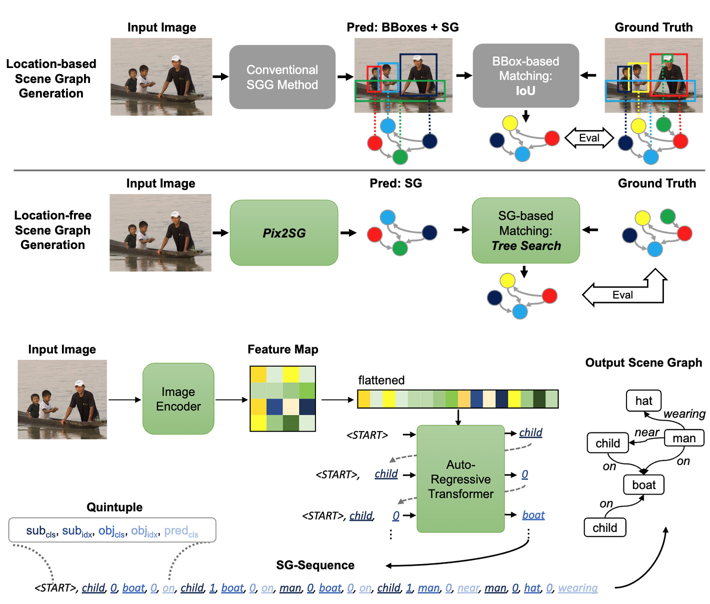

# Location-Free Scene Graph Generation



Official implementation of the paper "Location-Free Scene Graph Generation" (https://arxiv.org/abs/2303.10944). This repository contains the implementation of Pix2SG, the first method for
Location-Free Scene Graph Generation (LF-SGG). Unlike traditional scene graph generation approaches that rely on bounding boxes or segmentation masks, Pix2SG generates complete scene graphs directly
from images without any location supervision. Pix2SG leverages an autoregressive transformer architecture to predict scene graph quintuples (subject class, subject id, object class, object id,
predicate) sequentially. This approach eliminates the need for costly location annotations, reducing dataset preparation effort while maintaining competitive performance on standard benchmarks like
Visual Genome, Panoptic Scene Graph Dataset (PSG), and 4D-OR. Furthermore, we design a heuristic tree search-based evaluation, and implement in C++ for efficiency and speed. This evaluation algorithm
approximates the NP-hard scene graph matching problem, enabling objective assessment of location-free predictions without relying on localization cues. By using a configurable branching factor, it
balances matching quality and computational performance, making it a powerful tool for benchmarking and further research in the LF-SGG domain.

```
@inproceedings{ozsoy2025location,
  title={Location-free scene graph generation},
  author={{\"O}zsoy, Ege and Holm, Felix and Pellegrini, Chantal and Czempiel, Tobias and Saleh, Mahdi and Navab, Nassir and Busam, Benjamin},
  booktitle={Proceedings of the Computer Vision and Pattern Recognition Conference},
  pages={108--117},
  year={2025}
}
```

## Installation:

First install the correct pytorch version, we recommend using conda:

```conda install pytorch==2.0.1 torchvision==0.15.2 torchaudio==2.0.2 pytorch-cuda=11.7 -c pytorch -c nvidia```

Then install the rest of the requirements:

```pip install -r requirements.txt```

The heuristic tree search (branched matcher) is implemented in C++, so you need to compile it first. Go into the scene_graph_prediction dir and run:

```python setup_branched_ssg_matcher.py  build_ext --inplace```

You need a g++ version of 11.0 or higher to compile the code. (scl enable gcc-toolset-11 bash could work.

Finally, you need to structure the data correctly. "data" folder should look like this:
coco psg vg
Both coco and psg can be downloaded from the psg repository by following their instructions: https://github.com/Jingkang50/OpenPSG
The best of downloading visual genome (VG) changes time-to-time so it is best to do a quick google search.
Once you have the datasets, you are ready to proceed

## Training:

We currently support 4 image backbones, but this can be easily extended. The backbones are, efficientnetb5, efficientnetb7, eva_base(VIT) and eva_large(VIT):
to train them on PSG dataset, run one of the following:  
```python -m scene_graph_prediction.main_psg --config pix2sg_b5.json```  
```python -m scene_graph_prediction.main_psg --config pix2sg_b7.json```  
```python -m scene_graph_prediction.main_psg --config pix2sg_eva_base.json```  
```python -m scene_graph_prediction.main_psg --config pix2sg_eva_large.json```

Similarly to train them on Visual Genome dataset run one of the following:  
```python -m scene_graph_prediction.main_vg --config pix2sg_b5.json```  
```python -m scene_graph_prediction.main_vg --config pix2sg_b7.json```  
```python -m scene_graph_prediction.main_vg --config pix2sg_eva_base.json```  
```python -m scene_graph_prediction.main_vg --config pix2sg_eva_large.json```

## Evaluation:

Evaluation is quite similar, you just need to go to the main_psg or main_vg file and manually change the mode to "eval" and the checkpoint path to the desired model. Then run the file same as above.
Note: The maximum number of predicted relations are set to 20 by default, as evaluation takes also place during training and is quite slow with 300. However 300 gives the best results. You can
manually change this for the full evaluation.

## Acknowledgements:

We thank the Pix2Seq(https://github.com/google-research/pix2seq) and PSG (https://github.com/Jingkang50/OpenPSG) repositories.
